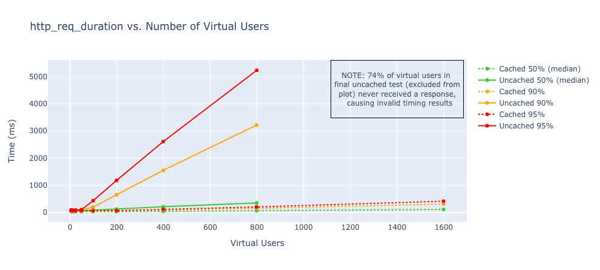
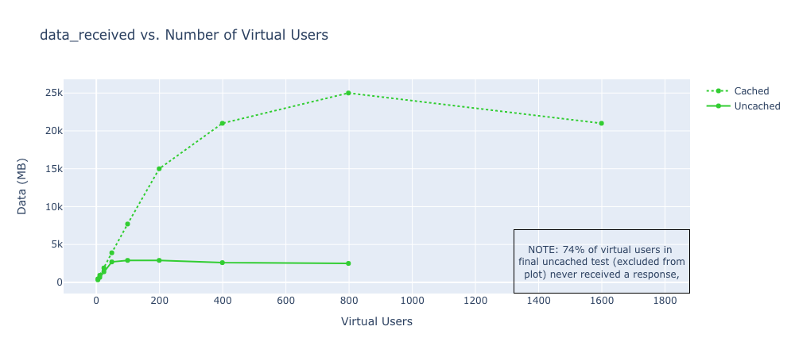

## DevOps Directive Site Load Testing

Corresponding Post: https://devopsdirective.com/posts/2020/03/load-testing-f1-micro/

- Tested using k6
- Tests performed on n1-standard-4 ubuntu 16.04 instance
- Tests performed with and without CloudFlare caching

[Binder Instance](https://mybinder.org/v2/gh/sidpalas/f1-micro-caddy-benchmark/master?filepath=plotting-load-test-results.ipynb)

